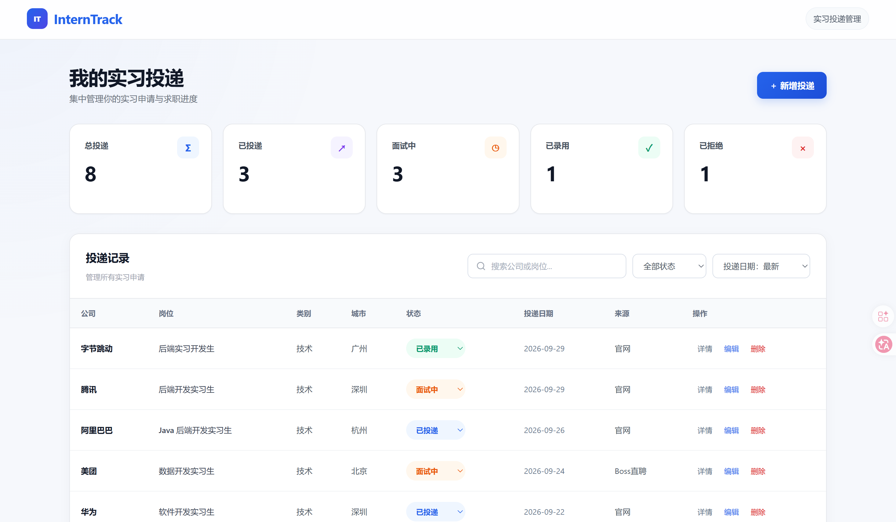
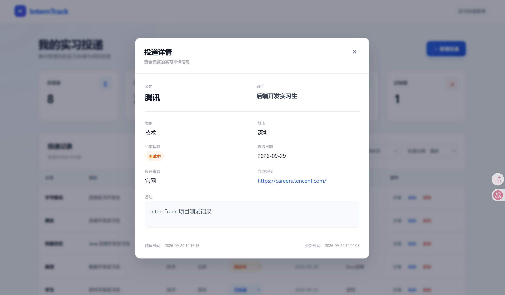
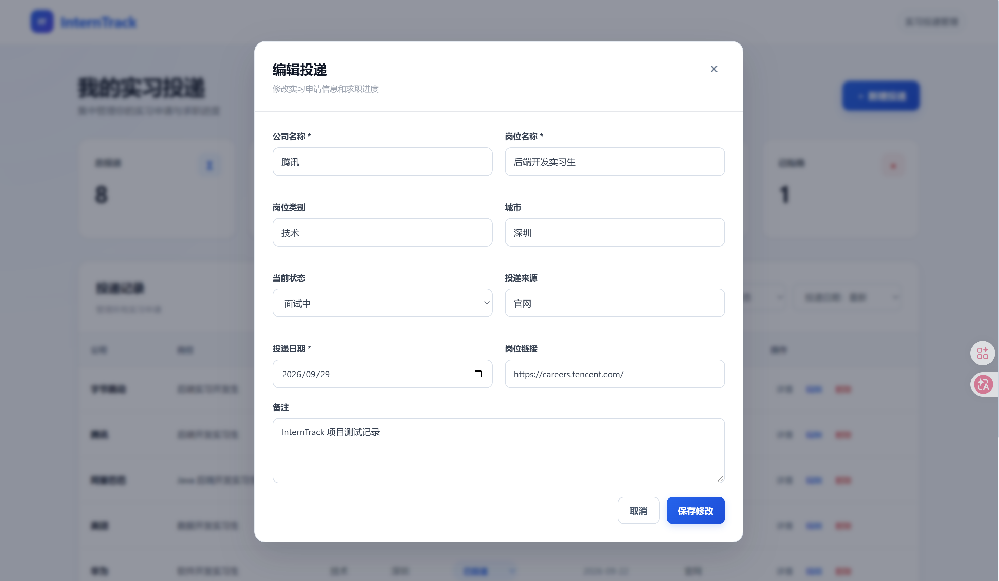

# InternTrack

一个面向大学生和求职者的轻量级实习投递管理系统，用于集中记录实习岗位、跟踪招聘进度，并通过 Dashboard 快速了解当前求职状态。

项目采用前后端分离架构，前端使用 HTML / CSS / JavaScript，后端使用 FastAPI + SQLAlchemy，数据存储采用 SQLite。

---

## 项目预览

### Dashboard



InternTrack 提供统一的实习投递 Dashboard，可查看总体投递数量及不同招聘状态，并支持搜索、筛选、排序和快速状态更新。

### 投递详情



用户可以查看单条实习申请的完整信息，包括岗位、城市、招聘状态、投递来源、岗位链接、备注以及创建和更新时间。

### 编辑投递



支持通过表单修改已有投递记录，并实时同步更新数据库与 Dashboard 统计数据。

---

## 功能特性

### Dashboard 数据统计

自动统计当前所有实习申请：

- 总投递
- 已投递
- 面试中
- 已录用
- 已拒绝

当投递状态发生变化时，Dashboard 会自动重新计算。

---

### 投递记录管理

支持完整 CRUD 操作：

- Create：新增投递
- Read：查看投递记录
- Update：编辑投递信息
- Delete：删除投递

每条记录可以包含：

- 公司
- 岗位
- 岗位类别
- 城市
- 当前状态
- 投递来源
- 投递日期
- 岗位链接
- 备注
- 创建时间
- 更新时间

---

### 快速状态更新

可以直接在表格中修改招聘状态，无需进入编辑页面。

支持状态：

- 已投递
- 面试中
- 已录用
- 已拒绝

状态修改后：

1. 数据写入 SQLite
2. 页面自动刷新
3. Dashboard 自动更新
4. 页面显示操作结果提示

---

### 搜索与筛选

支持根据：

- 公司名称
- 岗位名称

进行实时搜索。

同时可以按照招聘状态筛选：

- 全部状态
- 已投递
- 面试中
- 已录用
- 已拒绝

---

### 排序功能

支持：

- 投递日期：最新
- 投递日期：最早
- 最近更新
- 公司名称

---

### 投递详情

点击“详情”可以查看：

- 公司
- 岗位
- 类别
- 城市
- 招聘状态
- 投递日期
- 投递来源
- 岗位链接
- 备注
- 创建时间
- 更新时间

---

### 用户体验

项目实现了：

- Toast 操作提示
- Loading 加载状态
- 空数据状态
- 搜索无结果状态
- API 请求失败提示
- 响应式页面布局
- 状态颜色区分
- 弹窗动画
- 表格 Hover 交互

---

## 技术栈

### Frontend

- HTML5
- CSS3
- JavaScript
- Fetch API

### Backend

- Python
- FastAPI
- SQLAlchemy
- Pydantic

### Database

- SQLite

### Development

- VS Code
- Git
- GitHub

---

## 系统架构

```text
Browser
   │
   │ HTTP / JSON
   ▼
Frontend
HTML + CSS + JavaScript
   │
   │ Fetch API
   ▼
FastAPI
   │
   ▼
SQLAlchemy ORM
   │
   ▼
SQLite
interntrack.db
---

## 本地运行

### 1. 克隆项目

```bash
git clone https://github.com/yang81673-code/InternTrack.git
cd InternTrack